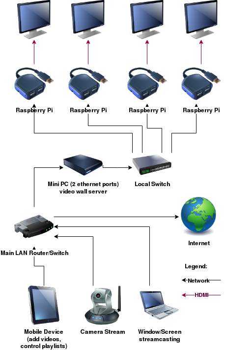

# Corollarium Software Videowall Installer


This repo installs [Corollarium Videowall](https://softwarevideowall.com) on a Linux system. This repo installs and configure a system for automatic updates (security Ubuntu and the Videowall software), log rotation, system monitoring, firewall, networking, etc. In the end you have a zero-manual maintenance system.

This was tested on a 20.04 Ubuntu Server installation with [Ansible](https://ansible.com) 2.9. Either the Server or Desktop Ubuntu 20.04 versions will work. Other Linux flavors might require tweaks.

This repo is not for the Raspberry Pi client. For Pis burn the [image provided](https://softwarevideowall.com) on the SD cards, which is already configured.

## Proposed setup

We suggest the following setup for your video wall:



This makes it completely independent: you don't have to configure anything from your current network system, there's no chance of conflicts of auto-discovery and the installation is fully automatic. It requires a server with two ethernet ports. 

But you can also use this script for a single port server, and handle the networking yourself.

## Basic installation

To install and set up the basic system:

1. Install [Ubuntu 20.04LTS server](https://ubuntu.com/download/server) on your server with the default options.
   1. Make sure that the Ethernet cable is connected before installing.
   1. Setup a swap disk during the installation.
   1. Choose to install a SSH server during installation. No other services are required.
   1. Name uniquely the machine during the installation.
   1. The user created should be called “videowall” on all machines (or you can change this on `group_vars/all.yml`).
1. After installation and reboot, login to the machine, either with a keyboard or through SSH.
1. Add the *installation machine’s* SSH public key to the machine. This is a [guide to setup passwordless ssh](https://www.tecmint.com/ssh-passwordless-login-using-ssh-keygen-in-5-easy-steps/) if you need details.
1. Validate that you can SSH to the videowall machine without a password.

## Running this system 

Install Ansible in your installation machine. Configure the `group_vars/all.yml` variables.

1. Edit `group_vars/all.yml` to see if the settings are sane. 
   1. Fill the correct Ethernet port setup. If you have two Ethernet ports and you are using your machine as a router, remember to make sure all that the network is connected to the correct Ethernet port. Failure to do so will freeze the installation and require a reinstall.
   ```yml
   internaleth: enp3s0 # the internal network interface as shown by `ip addr`
   externaleth: eno0 # the external network interface as shown by `ip addr`
   ```
   1. If you have only one Ethernet port or do not want to install a DNS/DHCP server, set these variables to false:
      ```yml
      dnsdhcp: false # set to true to run a dhcp server
      gateway: false # set to true to run a dhcp server
      ```
   1. Otherwise, check the `gateway4` and `gateway6` variables to see if they match your network.
1. Edit the `hosts` file. It should look like this, with the correct IPs (or server names if you setup DNS before) for all the video wall hosts. You can have zero servers or zero clients if you want. Add them one per line, like this:
   ```
   # hosts

   [server]
   myip1
   myip2

   [client]
   clientip1
   clientip2
   ```
   1. To check that the hosts are correctly configured, run ansible -i hosts all --list-hosts which should print all the list of hosts present in the hosts file:
      ```
      $ ansible -i hosts all --list-hosts
        hosts (1):
          192.168.0.14
      ```

   1. To check that the hosts can be accessed, run ansible -i hosts all -m ping -u videowall which should print that all hosts are connecting. Any problems in networking or ssh password setup will be caught here and should be fixed before proceeding:

      ```
      $ ansible -i hosts all -m ping -u videowall
      192.168.0.14 | SUCCESS => {
          "ansible_facts": {
              "discovered_interpreter_python": "/usr/bin/python3"
          },
          "changed": false,
          "ping": "pong"
      }
      ```

1. Run the installer. It will ask for a password, provide the videowall user password created during the Linux installation.
   1. For servers: `/usr/bin/ansible-playbook server.yml -i hosts --ask-become-pass`
   1. For clients: `/usr/bin/ansible-playbook client.yml -i hosts --ask-become-pass`

